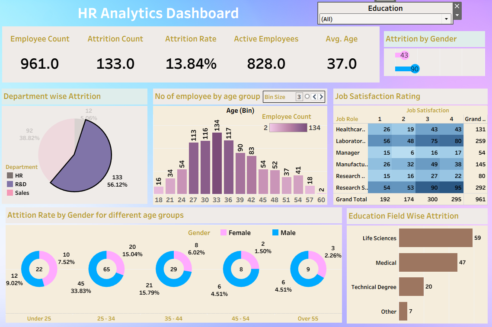

# HR Analytics Dashboard (Tableau)

This project features a comprehensive **HR Analytics Dashboard** built using **Tableau**, designed to help HR departments uncover attrition trends, demographic patterns, and job satisfaction insights. The dashboard is based on data from 961 employees.

Dataset used -  <a href = 'https://docs.google.com/spreadsheets/d/1-1Ldoe-DwZTL77tdMtRgZAIzeAzs0jh3/edit?usp=sharing&ouid=114134302031123244951&rtpof=true&sd=true'>Link</a>

## Key Features

- **Attrition Overview**: Highlights overall attrition rate (13.84%), count of active vs. exited employees, and average age.
- **Department-Level Analysis**: Identifies R&D as the department with the highest attrition (56.12%), followed by Sales and HR.
- **Demographics**: Visualizes employee distribution across age groups, with most employees in the 30–36 age range.
- **Gender Insights**: Shows attrition rate across age and gender, revealing higher attrition among younger females.
- **Education-Based Attrition**: Highlights Life Sciences and Medical fields as having the most attrition.
- **Job Satisfaction Matrix**: Uses heatmap formatting to explore how satisfaction levels vary by job role.

## Objective

To provide HR teams with actionable insights for:
- Identifying at-risk departments and demographics
- Designing better retention strategies
- Understanding satisfaction patterns by job roles

## Tools Used

- **Tableau Desktop**
- **Data Cleaning** (Excel / CSV)
- **Filters, Calculated Fields, Heatmaps**

## Key Insights

- Younger employees (under 35) show higher attrition.
- R&D has the highest department attrition.
- Female employees have slightly higher attrition across age brackets.
- Job roles with lower satisfaction scores show higher turnover.

