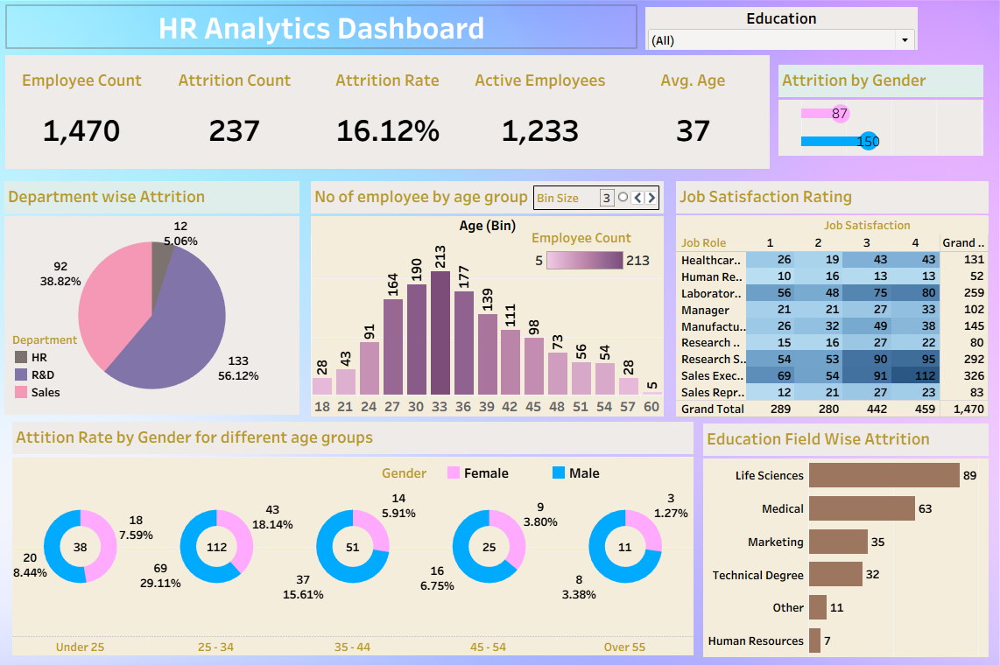

# HR Analytics Dashboard (Tableau)

This project features a comprehensive **HR Analytics Dashboard** built using **Tableau**, designed to help HR departments uncover attrition trends, demographic patterns, and job satisfaction insights. The dashboard is based on data from 961 employees.

## 📊 Key Features

- **Attrition Overview**: Highlights overall attrition rate (13.84%), count of active vs. exited employees, and average age.
- **Department-Level Analysis**: Identifies R&D as the department with the highest attrition (56.12%), followed by Sales and HR.
- **Demographics**: Visualizes employee distribution across age groups, with most employees in the 30–36 age range.
- **Gender Insights**: Shows attrition rate across age and gender, revealing higher attrition among younger females.
- **Education-Based Attrition**: Highlights Life Sciences and Medical fields as having the most attrition.
- **Job Satisfaction Matrix**: Uses heatmap formatting to explore how satisfaction levels vary by job role.

---

## 🎯 Objective

To provide HR teams with actionable insights for:
- Identifying at-risk departments and demographics
- Designing better retention strategies
- Understanding satisfaction patterns by job roles

---

## 🛠 Tools Used

- **Tableau Desktop**
- **Data Cleaning** (Excel / CSV)
- **Filters, Calculated Fields, Heatmaps**

---

## 🖥️ Files Included

- `Hr_data_analytics_dashboard.twb` – Tableau workbook
- `dash.png` – Dashboard image preview
- *(Optional)* `HR_data.csv` – Data file (if you’re including it)

---

## 🚀 How to Use

1. Open the `.twb` file in Tableau.
2. Ensure the data file is connected.
3. Explore filters (Education, Department, Gender) to dynamically drill into attrition trends.
4. Use visual KPIs to guide decision-making.

---

## 📌 Key Insights

- Younger employees (under 35) show higher attrition.
- R&D has the highest department attrition.
- Female employees have slightly higher attrition across age brackets.
- Job roles with lower satisfaction scores show higher turnover.

---

## 📬 Contact

**Created by:** [Your Name]  
**Email:** [youremail@example.com]  
**LinkedIn:** [linkedin.com/in/yourprofile]  

> *This dashboard is part of my data visualization portfolio. Feedback and collaboration are welcome!*
